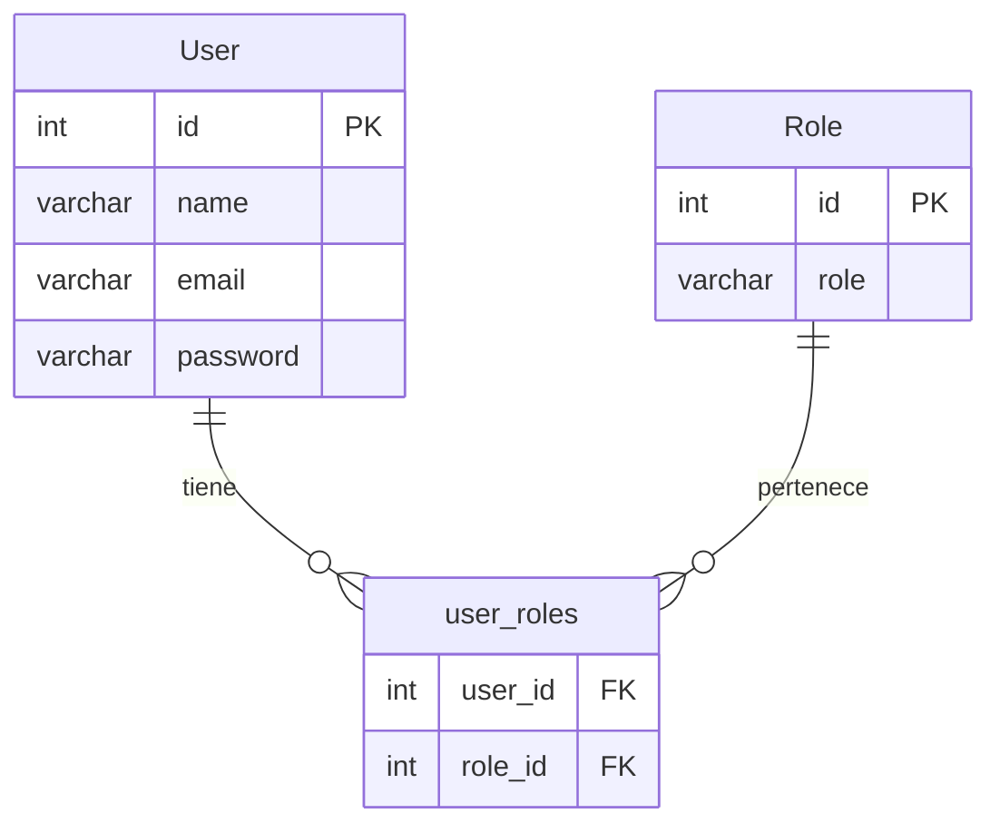

# 📰 Mundo Tech — Newspaper API

**Mundo Tech** es una API REST desarrollada con **Spring Boot 3** y **Java 25** como proyecto educativo para aprender los fundamentos de Spring Boot, arquitectura en capas, JPA y relaciones.

Actualmente gestiona **Usuarios** y **Roles** con una relación Many-to-Many, y está diseñada para crecer con funcionalidades como Artículos, flujo de revisión editorial y más.

## 📊 Diagrama de entidades



**User** y **Role** se relacionan Many-to-Many mediante la tabla intermedia `user_roles`.

## 🛠️ Tech Stack

- Java 25
- Spring Boot 3.5.16
- Maven 3.9.16 (Wrapper incluido)
- Spring Data JPA / Hibernate
- PostgreSQL (producción) / H2 (testing)
- Jakarta Validation
- Lombok
- spring-dotenv

## 📂 Estructura del proyecto

```
src/main/java/com/mundotech/newspaper/
├── NewspaperApplication.java
├── controller/
│   ├── UserController.java        # /api/v1/users
│   └── RoleController.java        # /api/v1/roles
├── entity/
│   ├── User.java
│   └── Role.java
├── repository/
│   ├── UserRepository.java
│   └── RoleRepository.java
└── service/
    ├── UserService.java
    ├── UserServiceImpl.java
    ├── RoleService.java
    └── RoleServiceImpl.java
```

## 📋Prerrequisitos

- Java 25+
- Maven 3.9+ (o usa el wrapper `./mvnw`)

## 🚀 Ejecutar el proyecto

```bash
# Copiar y configurar variables de entorno
cp .env.example .env

# Ejecutar con Maven Wrapper
./mvnw spring-boot:run
```

## 🔌 API Endpoints

| Método | Ruta               | Descripción                     |
|--------|--------------------|---------------------------------|
| POST   | /api/v1/users      | Crear usuario con roles         |
| GET    | /api/v1/users/{id} | Obtener usuario por ID          |
| POST   | /api/v1/roles      | Crear un rol                    |

## 🗄️ Configuración de BD

Por defecto usa **PostgreSQL**. Las credenciales se configuran en `.env`:

```
DB_URL=jdbc:postgresql://localhost:5432/mundotech
DB_USER=postgres
DB_PASSWORD=postgres
```

Para usar **H2** en desarrollo, descomenta la configuración en `application.properties`.

## 🗺️ Próximos pasos (roadmap)

### Fase 1 — Entidad Article y ArticleStatus
- Enum `ArticleStatus` con valores `DRAFT`, `IN_REVIEW`, `PUBLISHED`
- Entidad `Article` con relación `@ManyToOne` a `User` (autor)
- Eliminación en cascada: al borrar un usuario se borran sus artículos

### Fase 2 — CRUD de artículos

| Método | Ruta                          | Descripción                        |
|--------|-------------------------------|------------------------------------|
| POST   | /api/v1/articles              | Crear artículo (status DRAFT)      |
| GET    | /api/v1/articles              | Listar todos                       |
| GET    | /api/v1/articles/{id}         | Obtener por ID                     |
| GET    | /api/v1/articles?author={id}  | Buscar por autor                   |
| PUT    | /api/v1/articles/{id}         | Autor actualiza su artículo        |
| DELETE | /api/v1/articles/{id}         | Autor elimina su artículo          |
| DELETE | /api/v1/users/{id}            | Elimina usuario y artículos (cascada) |

### Fase 3 — Flujo de revisión
- `PATCH /api/v1/articles/{id}/submit` → autor envía a revisión (IN_REVIEW)
- `PATCH /api/v1/articles/{id}/approve` → manager aprueba (PUBLISHED)
- Endpoints para listar por estado: `/articles/status/draft`, `/in-review`, `/published`

### Fase 4 — Validaciones y calidad
- Jakarta Validation en DTOs
- `@ControllerAdvice` para manejo global de excepciones
- DTOs request/response
- Tests con JUnit 5 y colección de Postman

## 👩‍💻 Equipo de Desarrollo

| Nombre | Rol | GitHub |
|---|---|---|
| Damaris Castro | Developer | [@damcb1](https://github.com/damcb1) |
| Ivanna Caraccio | Developer | [@IvannaRCA](https://github.com/IvannaRCA) |
| Rosa Maria Naharro| Developer & Scrum Master | [@rosana50factoria](https://github.com/orgs/Cinephile-Team-2/people/rosana50factoria) |
| Andrea Tapia | Developer & Product Owner  | [@atapiamallea](https://github.com/atapiamallea) |

---

