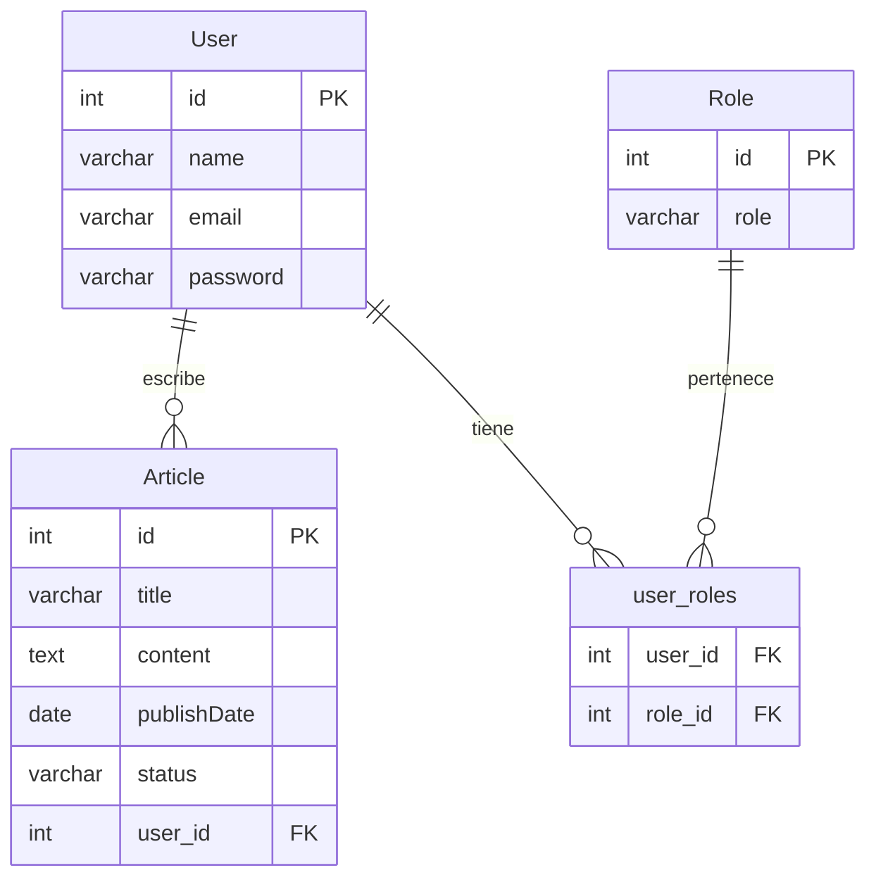

# 📰 Mundo Tech — Newspaper API

**Mundo Tech** is a REST API built with **Spring Boot 3** and **Java 25** as an educational project to learn the fundamentals of Spring Boot, layered architecture, JPA, and entity relationships.

The application manages **Users**, **Roles**, and **Articles**, including an editorial workflow that allows authors to submit articles for review and managers to publish them.

## 📊 Entities Diagram



**User** and **Role** are Many-to-Many related through the table `user_roles`.

## 🛠 Tech Stack

* Java 25
* Spring Boot 3.5.16
* Maven 3.9.16 (Maven Wrapper included)
* Spring Data JPA / Hibernate
* PostgreSQL (Production)
* Jakarta Validation
* Lombok
* spring-dotenv

## 📂 Project Structure

```text
src/main/java/com/mundotech/newspaper/
├── NewspaperApplication.java
├── controller/
│   ├── ArticleController.java
│   ├── UserController.java
│   └── RoleController.java
├── dto/
│   ├── request/
│   └── response/
├── entity/
│   ├── Article.java
│   ├── ArticleStatus.java
│   ├── User.java
│   └── Role.java
├── repository/
├── service/
...
```

## 📋 Prerequisites

* Java 25+
* Maven 3.9+
* PostgreSQL

## 🚀 Running the Project

### 1. Clone the repository

```bash
git clone https://github.com/Periodico-Mundo-Tech-Team-3/mundo-tech-backend.git
cd mundo-tech-backend
```

### 2. Configure the environment variables

Copy the example environment file:

```bash
cp .env.example .env
```

Then update the database credentials in the `.env` file:

```properties
DB_URL=jdbc:postgresql://localhost:5432/mundotech
DB_USER=postgres
DB_PASSWORD=your_password
```

### 3. Start the application

Using the Maven Wrapper:

```bash
./mvnw spring-boot:run
```

Or, if you have Maven installed globally:

```bash
mvn spring-boot:run
```

The API will be available at:

```
http://localhost:8080
```

## 🔌 API Endpoints

### Roles

|Method|Endpoint|Description|
|-|-|-|
|GET|`/api/v1/roles`|Retrieve all roles.|
|POST|`/api/v1/roles`|Create a new role.|

### Users

|Method|Endpoint|Description|
|-|-|-|
|GET|`/api/v1/users`|Retrieve all users.|
|POST|`/api/v1/users?rolesIds={roleId}`|Create a user and assign one or more roles.|
|DELETE|`/api/v1/users/{id}`|Delete a user and all associated articles.|

### Articles

|Method|Endpoint|Description|
|-|-|-|
|GET|`/api/v1/articles`|Retrieve all articles.|
|GET|`/api/v1/articles/{id}`|Retrieve an article by ID.|
|GET|`/api/v1/articles/status?status={status}&userId={id}`|Retrieve articles by status (`userId` required except for `PUBLISHED`).|
|GET|`/api/v1/articles/author?authorId={authorId}`|Retrieve articles by author.|
|POST|`/api/v1/articles/{userId}`|Create a new article.|
|PUT|`/api/v1/articles/{id}`|Update an article.|
|PUT|`/api/v1/articles/{id}/{userLoginId}`|Update an article if the logged-in user is the author.|
|DELETE|`/api/v1/articles/{articleId}/{userId}`|Delete an article if the requesting user is the author.|
|GET|`/api/v1/articles/{id}/submit?userId={userId}`|Submit article (`DRAFT → IN_REVIEW`).|
|GET|`/api/v1/articles/{id}/publish?userId={userId}`|Publish article (`IN_REVIEW → PUBLISHED`).|
|GET|`/api/v1/articles/{id}/reject?userId={userId}`|Reject article (`IN_REVIEW → DRAFT`).|

## 📚 Data Model

* **Article** → Many-to-One with User
* **User** → Many-to-Many with Role, One-to-Many with Article
* **Role** → Many-to-Many with User

## 🔄 Article Workflow

```text
DRAFT
  ↓            ↑
IN_REVIEW or REJECT
  ↓
PUBLISHED
```

## 🧪 Testing

Integration tests cover:

* Article submission
* Status transitions
* Authorization checks
* Role-based access

## 👩‍💻 Development Team

| Name | Role | GitHub |
|---|---|---|
| Damaris Castro | Developer | [@damcb1](https://github.com/damcb1) |
| Ivanna Caraccio | Developer | [@IvannaRCA](https://github.com/IvannaRCA) |
| Rosa Maria Naharro| Developer & Scrum Master | [@rosana50factoria](https://github.com/orgs/Cinephile-Team-2/people/rosana50factoria) |
| Andrea Tapia | Developer & Product Owner  | [@atapiamallea](https://github.com/atapiamallea) |
